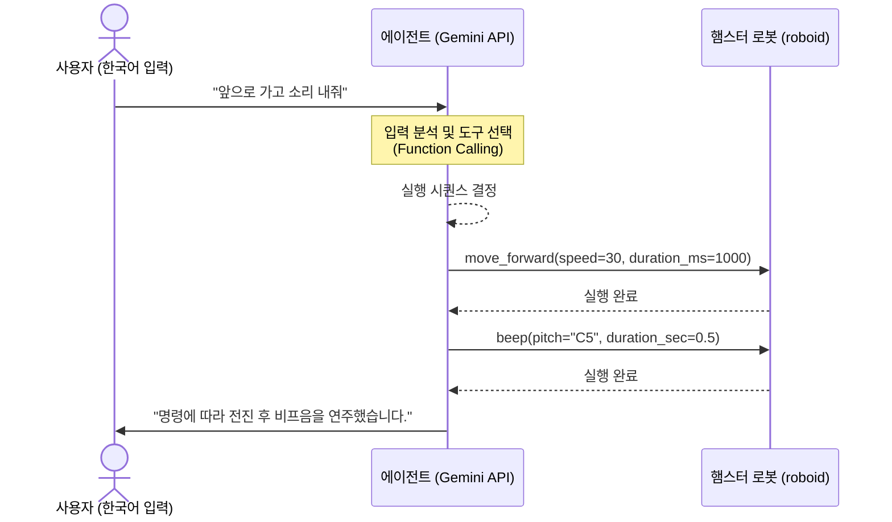

# 햄스터 로봇 자연어 명령 에이전트 설계서 (AGENTS.md)

이 문서는 사용자의 자연어(한국어) 명령을 분석하여 햄스터 로봇을 자동으로 제어하는 **자연어 명령 해석 에이전트(Natural Language Command Agent)**의 역할, 아키텍처 및 제어 도구 명세를 정의합니다.

---

## 1. 개요
* **에이전트명**: 자연어 명령 에이전트 (Natural Language Command Agent)
* **주요 목적**: 사용자가 말하거나 입력하는 일상적인 명령(예: "앞으로 조금만 가고 삑 소리 내줘")을 해석하고, 로봇 제어 API를 순차적으로 실행하여 로봇이 명령에 따르도록 합니다.
* **개발 라이브러리**:
  - Python 패키지: `google-genai`
  - LLM 엔진: Google Gemini (Gemini 2.5 또는 1.5 모델)

---

## 2. 동작 아키텍처
에이전트는 LLM의 **Function Calling (도구 호출)** 매커니즘을 기반으로 작동합니다.



1. **입력 수신**: 사용자가 자연어(텍스트/음성)로 명령을 입력합니다.
2. **도구 정의**: 에이전트에 햄스터 로봇을 제어할 수 있는 Python 함수(도구)들을 바인딩하여 제공합니다.
3. **의도 분석**: Gemini 모델이 입력을 분석하여 제공된 도구들 중 실행해야 하는 도구와 매개변수(인자)를 결정합니다.
4. **순차 실행**: 에이전트 러너가 Gemini가 반환한 도구 호출 목록을 순서대로 해석하여 실시간으로 햄스터 로봇을 조작합니다.

---

## 3. 에이전트 도구(Tools) 명세

에이전트가 호출할 수 있도록 제공되는 핵심 로봇 제어 API 목록입니다.

### 3.1 `move_forward(speed: int = 30, duration_ms: int = 1000)`
* **설명**: 로봇을 일정 시간 동안 전진시킵니다.
* **매개변수**:
  - `speed`: 모터 속도 (10 ~ 100)
  - `duration_ms`: 이동 시간 (밀리초 단위)

### 3.2 `move_backward(speed: int = 30, duration_ms: int = 1000)`
* **설명**: 로봇을 일정 시간 동안 후진시킵니다.
* **매개변수**:
  - `speed`: 모터 속도 (10 ~ 100)
  - `duration_ms`: 이동 시간 (밀리초 단위)

### 3.3 `turn_left(speed: int = 30, duration_ms: int = 500)`
* **설명**: 로봇을 왼쪽으로 제자리 회전시킵니다.
* **매개변수**:
  - `speed`: 회전 속도 (10 ~ 100)
  - `duration_ms`: 회전 시간 (밀리초 단위)

### 3.4 `turn_right(speed: int = 30, duration_ms: int = 500)`
* **설명**: 로봇을 오른쪽으로 제자리 회전시킵니다.
* **매개변수**:
  - `speed`: 회전 속도 (10 ~ 100)
  - `duration_ms`: 회전 시간 (밀리초 단위)

### 3.5 `stop()`
* **설명**: 로봇의 양쪽 바퀴 모터를 즉시 정지시킵니다.

### 3.6 `beep(pitch: str = "C5", duration_sec: float = 0.2)`
* **설명**: 내장 부저로 특정 음계의 소리를 냅니다.
* **매개변수**:
  - `pitch`: 음계 이름 (예: "C5"는 5옥타브 도, "E5"는 5옥타브 미)
  - `duration_sec`: 소리 재생 시간 (초 단위)

---

## 4. 시나리오 예시

### 시나리오 A: 단순 순차 이동 및 소리
* **사용자 명령**: `"속도 50으로 2초 동안 앞으로 갔다가 삑 소리 한 번만 내줘."`
* **에이전트의 도구 호출 계획**:
  1. `move_forward(speed=50, duration_ms=2000)`
  2. `beep(pitch="C5", duration_sec=0.2)`
  3. `stop()`

### 시나리오 B: 복합 제어
* **사용자 명령**: `"오른쪽으로 돌고 1초 쉬었다가 뒤로 1초 후진해."`
* **에이전트의 도구 호출 계획**:
  1. `turn_right(speed=30, duration_ms=500)`
  2. (일시 대기) `time.sleep(1.0)`
  3. `move_backward(speed=30, duration_ms=1000)`
  4. `stop()`

---

## 5. 실행 환경 설정

### 5.1 필수 라이브러리 설치
이 프로젝트는 `uv`를 사용해 패키지를 관리합니다.
```powershell
uv sync
```

### 5.2 API Key 설정
Gemini API 호출을 위해 환경 변수에 `GEMINI_API_KEY`를 등록해야 합니다.
* **Windows (PowerShell)**:
  ```powershell
  $env:GEMINI_API_KEY="your-gemini-api-key-here"
  ```
* **Linux/macOS**:
  ```bash
  export GEMINI_API_KEY="your-gemini-api-key-here"
  ```

---

## 6. 구현 및 개발 지침
* **docs/ 문서 필수 참고**:
  - 로봇 제어 기능(예: LED, 소리, 센서, 자율주행 등)을 실제 코드로 구현할 때는 프로젝트 내 [docs/](file:///c:/Users/user/Desktop/hamster/docs) 디렉토리에 있는 차시별 학습 가이드 문서(예: `03차시-LED켜고-소리내기.md`, `05차시-근접센서-사용하기.md` 등)를 먼저 확인해야 합니다.
  - 각 문서에 기술된 API 사용법(예: 바퀴 모터 제어, 부저 음계 설정, 센서 값 읽기 등)과 공식 권장 패턴을 준수하여 에이전트와 도구를 개발해야 합니다.
